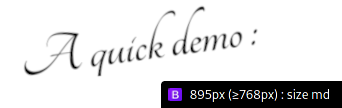

## BootstrapBreakpointInfo

> Wow, such a long repo name. But what does this thing do ?

BootstrapBreakpointInfo is a small JS script to display the current Bootstrap breakpoint ([more info here](https://getbootstrap.com/docs/5.0/layout/breakpoints/#available-breakpoints)) directly on the bottom right corner of any webpage.



### How to use ?

Place the following line on the bottom of your webpage, right before the closing `</body>` tag : 

```html
<script src="https://bdelphin.github.io/BootstrapBreakpointInfo/breakpoints.js"></script>
```

Reload, that's it !

### Contributions & issues

Feel free to make a pull request if you want to improve this thing (it just took a few minutes to make, so I'm sure it can be improved a lot), and if you encounter any issue please use [the appropriate section on the Github Repo](https://github.com/bdelphin/BootstrapBreakpointInfo/issues) !
